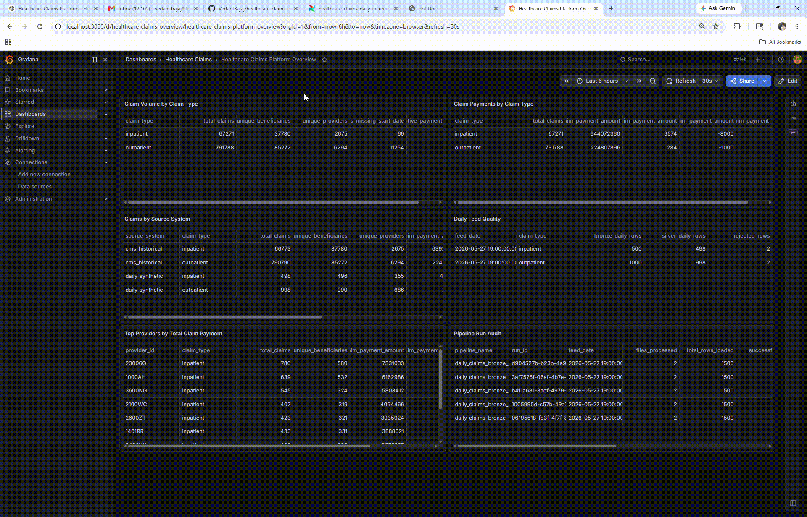

# Healthcare Claims Data Platform

A production-style healthcare claims data platform built with **Python, PostgreSQL, Docker, dbt, Apache Airflow, and Grafana**.

This project shows how healthcare claims data can move from raw CSV files into trusted analytics tables, automated pipelines, audit logs, and dashboards.

## Project Demo

<table>
  <tr>
    <td align="center">
      <b>dbt Lineage & Docs</b><br>
      
    </td>
    <td align="center">
      <b>Airflow Orchestration</b><br>
      
    </td>
    <td align="center">
      <b>Grafana Dashboard</b><br>
      
    </td>
  </tr>
</table>

<!-- ### dbt Lineage and Documentation


### Airflow Orchestration


### Grafana Monitoring Dashboard

 -->


## What This Project Does

This platform processes CMS SynPUF healthcare claims data through a modern data engineering workflow.

It supports two types of processing:

1. **Historical load**  
   Loads the original CMS SynPUF beneficiary, inpatient, and outpatient claims files.

2. **Daily incremental load**  
   Generates small synthetic daily claims files, loads only the latest daily feed, validates it, and refreshes analytics tables.

The project includes:

- Raw CMS claims ingestion
- Daily synthetic claims generation
- Bronze, Silver, and Gold data layers
- Python validation checks
- dbt transformations and tests
- Airflow orchestration
- Pipeline audit logging
- Grafana dashboarding
- GitHub Actions CI checks

---

## Tech Stack

| Area | Tool |
|---|---|
| Programming | Python |
| Database / Warehouse | PostgreSQL |
| Containerization | Docker Compose |
| Transformation | dbt Core |
| Orchestration | Apache Airflow |
| Dashboarding | Grafana |
| Testing | Python validation + dbt tests |
| Documentation | dbt Docs |
| CI/CD | GitHub Actions |
| Version Control | Git and GitHub |

---

## Dataset

This project uses **CMS DE-SynPUF Sample 1**.

CMS SynPUF is a synthetic Medicare claims dataset that resembles real Medicare claims data while protecting patient privacy.

Historical files used:

- 2008 Beneficiary Summary
- 2009 Beneficiary Summary
- 2010 Beneficiary Summary
- 2008–2010 Inpatient Claims
- 2008–2010 Outpatient Claims

Raw CSV files are **not committed to GitHub** because they are large.

Place them locally here:

```text
data/external/cms_synpuf/sample_1/
```

Expected files:

```text
DE1_0_2008_Beneficiary_Summary_File_Sample_1.csv
DE1_0_2009_Beneficiary_Summary_File_Sample_1.csv
DE1_0_2010_Beneficiary_Summary_File_Sample_1.csv
DE1_0_2008_to_2010_Inpatient_Claims_Sample_1.csv
DE1_0_2008_to_2010_Outpatient_Claims_Sample_1.csv
```

---

## High-Level Architecture

```text
CMS SynPUF Historical Files
        ↓
Python Historical Loader
        ↓
PostgreSQL Bronze Tables
        ↓
dbt Staging Models
        ↓
dbt Silver Tables
        ↓
dbt Gold Marts
        ↓
Grafana Dashboard
```

Daily incremental flow:

```text
Synthetic Daily Claims Generator
        ↓
Latest Daily Feed Loader
        ↓
Daily Bronze Validation
        ↓
dbt Silver + Gold Refresh
        ↓
Daily Feed Quality + Audit Marts
        ↓
Grafana Dashboard
```

Airflow controls the pipeline execution.

---

## Data Layers

### Bronze Layer

Bronze stores raw data with minimal changes.

Tables include:

```text
bronze.beneficiary_summary
bronze.inpatient_claims
bronze.outpatient_claims
bronze.daily_inpatient_claims
bronze.daily_outpatient_claims
```

Bronze keeps source metadata such as:

```text
source_file_name
source_year
feed_date
ingested_at
```

Bad records are allowed in Bronze so they can be audited and traced.

---

### Staging Layer

Staging models clean and standardize the raw Bronze data.

Examples:

```text
stg_beneficiary_summary
stg_inpatient_claims
stg_outpatient_claims
stg_daily_inpatient_claims
stg_daily_outpatient_claims
```

Staging handles:

- Column renaming
- Date casting
- Numeric casting
- Claim type labels
- Source system labels
- Metadata retention

---

### Silver Layer

Silver contains trusted, cleaned tables.

Main tables:

```text
silver_beneficiaries
silver_claims
```

Silver combines:

```text
historical inpatient claims
historical outpatient claims
daily inpatient claims
daily outpatient claims
```

Invalid daily records, such as missing claim IDs or beneficiary IDs, are filtered out before reaching Silver.

---

### Gold Layer

Gold contains analytics-ready marts.

Main marts:

```text
mart_claim_volume
mart_claim_payments
mart_provider_performance
mart_claims_by_source_system
mart_daily_claim_feed_quality
mart_pipeline_run_audit
```

These marts support:

- Claim volume analysis
- Payment analysis
- Provider performance analysis
- Daily feed quality monitoring
- Pipeline run monitoring
- Source system comparison

---

## Airflow Orchestration

The project has two Airflow DAGs.

| DAG | Purpose |
|---|---|
| `healthcare_claims_historical_bootstrap` | Loads the historical CMS files and refreshes dbt models |
| `healthcare_claims_daily_incremental` | Generates and loads the latest daily synthetic claims feed |

### Historical Bootstrap DAG

Use this when rebuilding the warehouse from scratch.

```text
Check historical files
        ↓
Load historical Bronze tables
        ↓
Validate historical Bronze
        ↓
dbt deps
        ↓
dbt run
        ↓
dbt test
```

### Daily Incremental DAG

Use this for normal daily processing.

```text
Check landing directory
        ↓
Generate daily claims feed
        ↓
Load latest daily feed into Bronze
        ↓
Validate daily Bronze
        ↓
dbt deps
        ↓
dbt run
        ↓
dbt test
```

The daily DAG avoids reloading the large historical outpatient claims file.

---

## Daily Synthetic Claims Feed

The daily feed generator creates small synthetic daily claim files from historical CMS patterns.

Script:

```text
ingestion/generators/generate_daily_claims_feed.py
```

Generated files are saved under:

```text
data/landing/daily_claims/
```

Example files:

```text
daily_inpatient_claims_2026_05_28.csv
daily_outpatient_claims_2026_05_28.csv
```

The generator creates:

- New daily claim IDs
- Recent claim dates
- Adjusted payment amounts
- Controlled bad records for testing

It intentionally injects records with:

- Missing claim IDs
- Missing beneficiary IDs
- Negative payments
- Missing claim start dates

These records are kept in Bronze, detected during validation, and filtered before Silver.

---

## Data Quality

This project uses two types of validation.

### Python Validation

Python scripts validate Bronze data.

Scripts:

```text
ingestion/validators/validate_bronze.py
ingestion/validators/validate_daily_bronze.py
```

Checks include:

- Tables contain rows
- Required IDs are present
- Claims connect to beneficiaries
- Feed date is populated
- Missing IDs are tracked
- Negative payments are tracked
- Missing claim dates are tracked

Warnings are allowed for known raw-data issues and controlled synthetic bad records.

### dbt Tests

dbt tests validate Staging, Silver, and Gold models.

Tests include:

- `not_null`
- `unique`
- `accepted_values`
- `relationships`
- Custom uniqueness tests

Recent dbt result:

```text
PASS=39 WARN=0 ERROR=0 TOTAL=39
```

---

## Audit Logging

Daily Bronze loads write audit records into:

```text
audit.pipeline_run_log
```

Each load records:

```text
pipeline_name
run_id
feed_date
source_file_name
target_table
rows_loaded
status
error_message
started_at
ended_at
```

A Gold mart summarizes audit records:

```text
silver_marts.mart_pipeline_run_audit
```

Example:

| Pipeline | Feed Date | Files Processed | Rows Loaded | Status |
|---|---:|---:|---:|---|
| daily_claims_bronze_load | 2026-05-28 | 2 | 1,500 | success |

---

## Grafana Dashboard

Grafana visualizes the Gold marts from PostgreSQL.

Dashboard:

```text
Healthcare Claims Platform Overview
```

Panels include:

- Claim volume by claim type
- Claim payments by claim type
- Claims by source system
- Daily feed quality
- Top providers by total claim payment
- Pipeline run audit

Grafana files:

```text
grafana/provisioning/datasources/postgres.yml
grafana/provisioning/dashboards/dashboards.yml
grafana/dashboards/healthcare_claims_dashboard.json
```

Open Grafana:

```text
http://localhost:3000
```

Login:

```text
admin / admin
```

---

## Current Data Volumes

| Table / Mart | Row Count |
|---|---:|
| Bronze Beneficiary Summary | 343,644 |
| Bronze Inpatient Claims | 66,773 |
| Bronze Outpatient Claims | 790,790 |
| Bronze Daily Inpatient Claims | 500 |
| Bronze Daily Outpatient Claims | 1,000 |
| Silver Beneficiaries | 116,352 |
| Silver Claims with Daily Feed | 859,059 |
| Provider Performance Mart | 8,969 |

Daily feed quality:

| Feed Date | Claim Type | Bronze Rows | Silver Rows | Rejected Rows |
|---|---|---:|---:|---:|
| 2026-05-28 | inpatient | 500 | 498 | 2 |
| 2026-05-28 | outpatient | 1,000 | 998 | 2 |

---

## Repository Structure

```text
healthcare-claims-data-platform/
│
├── airflow/
│   └── dags/
│       ├── healthcare_claims_historical_bootstrap.py
│       └── healthcare_claims_daily_incremental.py
│
├── data/
│   ├── external/
│   ├── landing/
│   └── raw/
│
├── ingestion/
│   ├── generators/
│   ├── loaders/
│   └── validators/
│
├── warehouse/
│   ├── init.sql
│   ├── daily_tables.sql
│   └── audit_tables.sql
│
├── dbt/
│   └── healthcare_claims/
│       ├── models/
│       │   ├── staging/
│       │   ├── silver/
│       │   └── marts/
│       └── tests/
│
├── grafana/
│   ├── provisioning/
│   └── dashboards/
│
├── .github/
│   └── workflows/
│
├── Dockerfile.airflow
├── docker-compose.yml
├── requirements.txt
├── requirements-airflow.txt
└── README.md
```

---

## How to Run Locally

### 1. Clone the repository

```bash
git clone https://github.com/VedantBajaj/healthcare-claims-data-platform.git
cd healthcare-claims-data-platform
```

### 2. Create a virtual environment

```powershell
python -m venv .venv
.venv\Scripts\activate
pip install -r requirements.txt
```

### 3. Start Docker services

```powershell
docker compose up -d --build
```

Expected services:

```text
healthcare_claims_postgres
healthcare_airflow_postgres
healthcare_airflow_webserver
healthcare_airflow_scheduler
healthcare_grafana
```

### 4. Create `.env`

Create a `.env` file in the project root:

```env
POSTGRES_HOST=localhost
POSTGRES_PORT=5432
POSTGRES_DB=claims_warehouse
POSTGRES_USER=claims_user
POSTGRES_PASSWORD=claims_password
```

### 5. Add raw CMS files

Place CMS SynPUF files here:

```text
data/external/cms_synpuf/sample_1/
```

### 6. Apply daily and audit tables

```powershell
Get-Content warehouse/daily_tables.sql | docker exec -i healthcare_claims_postgres psql -U claims_user -d claims_warehouse
Get-Content warehouse/audit_tables.sql | docker exec -i healthcare_claims_postgres psql -U claims_user -d claims_warehouse
```

### 7. Run historical load manually

```powershell
python ingestion/loaders/load_bronze.py
python ingestion/validators/validate_bronze.py
```

### 8. Run daily load manually

```powershell
python ingestion/generators/generate_daily_claims_feed.py
python ingestion/loaders/load_daily_bronze.py
python ingestion/validators/validate_daily_bronze.py
```

### 9. Run dbt

```powershell
cd dbt/healthcare_claims
dbt deps
dbt run --profiles-dir .
dbt test --profiles-dir .
```

### 10. Open Airflow

```text
http://localhost:8082
```

Login:

```text
admin / admin
```

Available DAGs:

```text
healthcare_claims_historical_bootstrap
healthcare_claims_daily_incremental
```

Use:

- Historical bootstrap DAG only when rebuilding base data
- Daily incremental DAG for normal daily processing

Do not run both at the same time.

### 11. Open Grafana

```text
http://localhost:3000
```

Login:

```text
admin / admin
```

Dashboard:

```text
Dashboards → Healthcare Claims → Healthcare Claims Platform Overview
```

### 12. Generate dbt docs

```powershell
cd dbt/healthcare_claims
dbt docs generate --profiles-dir .
dbt docs serve --port 8081
```

Open:

```text
http://localhost:8081
```

---

## How Everything Works Together

1. CMS files are placed locally under `data/external/`.
2. Python loads those files into Bronze tables.
3. Python validators check raw data quality.
4. dbt transforms Bronze data into clean Staging views.
5. dbt builds trusted Silver tables.
6. dbt builds Gold marts for analytics.
7. The daily generator creates small daily claims files.
8. The daily loader loads only the latest daily feed.
9. Bad daily records are retained in Bronze but filtered before Silver.
10. Audit logs track daily load execution.
11. Airflow orchestrates historical and daily workflows.
12. Grafana reads Gold marts and shows dashboards.
13. GitHub Actions checks Python syntax and dbt project structure.

---

## Key Learnings

This project demonstrates:

- Building a medallion-style data platform
- Loading large healthcare CSV files with Python
- Separating historical and daily incremental pipelines
- Using dbt for SQL transformations and testing
- Using Airflow for orchestration
- Using Grafana for monitoring
- Adding pipeline audit logging
- Preserving raw data while creating trusted analytics tables
- Handling realistic data quality issues
- Keeping raw and generated data out of GitHub

---

## Future Enhancements

Planned improvements:

- Store multi-day daily feed history instead of latest-feed-only loading
- Add Great Expectations for advanced validation
- Add more Grafana charts and alerts
- Add GitHub Actions with a temporary Postgres test database
- Add CMS Carrier Claims and Prescription Drug Events data
- Deploy a cloud version using GCP, BigQuery, and Cloud Composer